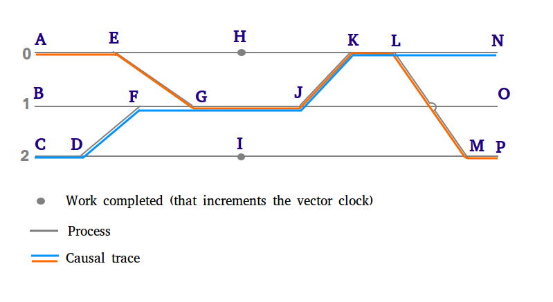

#Vector Clocks
Vector clocks are used to determine causal relationships
that can exist between multiple processes.  

The following diagram shows 3 processes, as indicated by 
horizontal grey lines. When a processes interacts with 
another (by passing information), this communication forms 
a causal dependency.  This causal dependency is indicated 
on the following diagram by the diagonal lines drawn 
between the processes.



The above diagram shows two "causal traces", as indicated 
by orange and blue lines. In these "causal traces", every 
given position on the colored line is causally related to 
every other position on the colored line, such that 
positions to the left happened before positions to the right.

This repo contains a 
[vector clock library](vector_clock/clock.go) that stores 
the vector clock implementation logic. The 
[main module](main/main.go) uses this library to encode 
the above diagram in a declarative format for 
demonstration purposes.

##Demo
This section will walk through the code from the main 
function, and showing how vector clocks can be used 
to encode the causal relationship shown in the 
diagram above.

First, we’ll initialize vector clocks each of the 
3 processes, and save copies for later comparison:
```python
>>> vec := initVectors(3)
>>> initialVecs := copyVectors(vec)
>>> printState(vec)
State of all Vector Clocks:
0:[1,0,0]
1:[0,1,0]
2:[0,0,1]
```
Let’s check the causal relationships between the vectors:
```python

>>> printCompare(vec[0], vec[1])
Compare Vector 0 with 1:
0:[1,0,0]
Is Concurrent With
1:[0,1,0]

>>> printCompare(vec[1], vec[2])
Compare Vector 1 with 2:
1:[0,1,0]
Is Concurrent With
2:[0,0,1]

>>> printCompare(vec[2], vec[0])
Compare Vector 2 with 0:
2:[0,0,1]
Is Concurrent With
0:[1,0,0]
```

Next, we’ll send messages between between processes, 
shown in the diagram at positions D and E:
```python
>>> printSendMessage(vec[2], vec[1])
Sending Message from 2 to 1:
Before:    2:[0,0,1], 1:[0,1,0]
After:    2:[0,0,2], 1:[0,2,2]

>>> printSendMessage(vec[0], vec[1])
Sending Message from 0 to 1:
Before:    0:[1,0,0], 1:[0,2,2]
After:    0:[2,0,0], 1:[2,3,2]
```

Points G and E should now be causally related:
```python
>>> printCompare(vec[0], vec[1])
Compare Vector 0 with 1:
0:[2,0,0]
Happened Before
1:[2,3,2]
```

Let’s show how the vector clocks encode the “work” 
done at H and I in the diagram:
```python
>>> printDoWork(vec[0])
Vector Clock 0 Does work Work:
Before: 0:[2,0,0]
After: 0:[3,0,0]

>>> printDoWork(vec[2])
Vector Clock 2 Does work Work:
Before: 2:[0,0,2]
After: 2:[0,0,3]
```

As a sanity check, we’ll check the causal 
relationship between points G and H, as 
shown in the diagram above.  They should be 
causally concurrent:
```python
>>> printCompare(vec[0], vec[1])
Compare Vector 0 with 1:
0:[1,0,0]
Is Concurrent With
1:[0,1,0]
```

Next, we’ll send the final message, shown 
at position L:
```python
>>> printSendMessage(vec[0], vec[2])
Sending Message from 0 to 2:
Before:    0:[3,0,0], 2:[0,0,3]
After:    0:[4,0,0], 2:[4,0,4]
```

Finally, let’s check the causality in the blue 
path. As shown in the diagram, position N should 
depend on position C, but not A. 
```python
>>> printCompare(vec[0], initialVecs[0])
Compare Vector 0 with 0:
0:[4,0,0]
Happened After
0:[1,0,0]

>>> printCompare(vec[0], initialVecs[2])
Compare Vector 0 with 2:
0:[4,0,0]
Is Concurrent With
2:[0,0,1]
```


